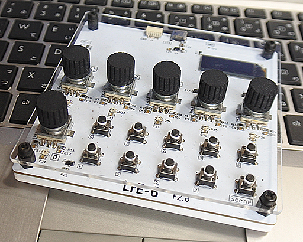

# LrE-6
Adobe Lightroom MIDI Developper Controller project (STM32F072 based)  
LrE-6 MIDI controller is formed by embedded hardware board and its firmware.  
It used with [MIDI2LR](https://github.com/rsjaffe/MIDI2LR) software,  
You can control development parameters on RAW photos.  
[YouTube](https://www.youtube.com/watch?v=oeDpP1sG9_Y)  
  
Information related Build,Configure & Use are exists on wiki.  
***
Lightroom is Registerd Trademark of Adobe Corp.